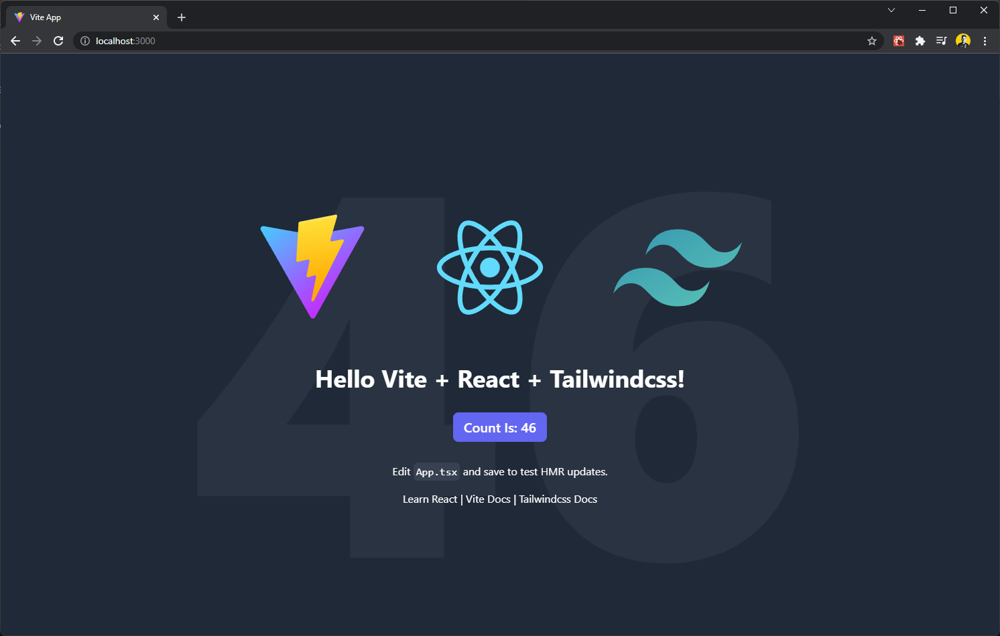
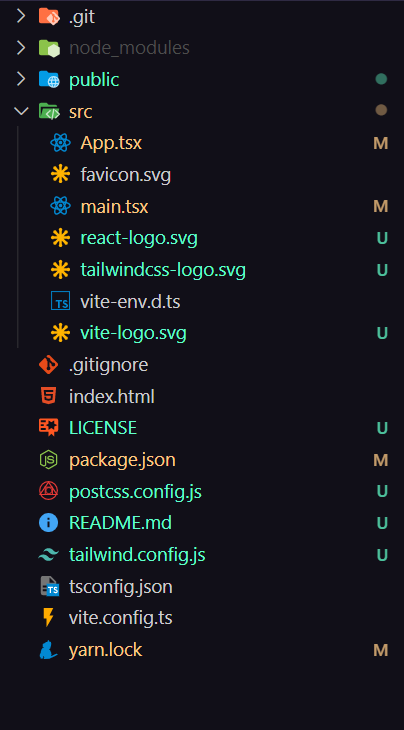
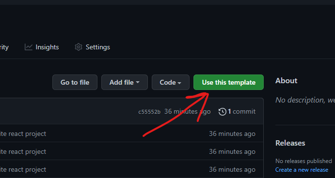

# React + Tailwindcss + TypeScript + Vite Starter Template



This is a starter template for React + Tailwindcss + TypeScript + Vite.

### Project Structure



## How to use this template?

### Use Templete

You can use this template by just creating a new repo with this template by clicking on the "Use this template" button.



### Clone this repo

You can also clone this repo.

```bash
git clone https://github.com/rohid-hub/react-tailwindcss-typescript-vite-template.git
```

## Installation

After cloning the repo go to the directory and run

```bash
yarn
```

Then run the dev server by running

```bash
yarn dev
```

After this go to `htpp://localhost:3000` and you should see this screen.


If this repo helps you then please don't forget to give this repo a star ☺️

Thank you
